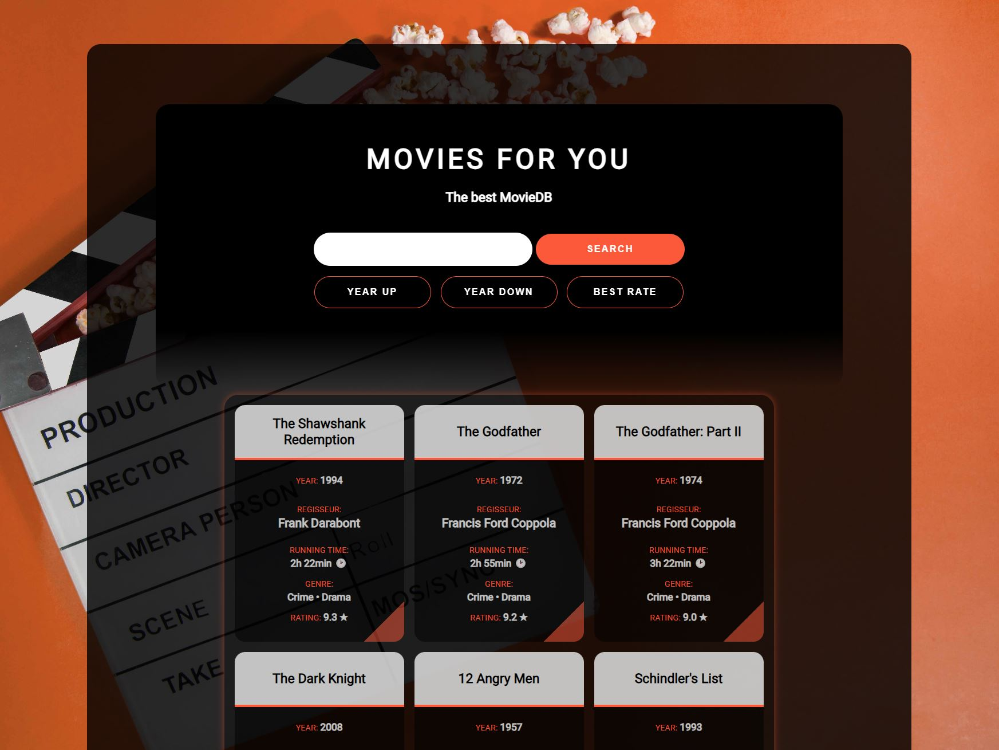

# Movie Datenbank – JavaScript-Projekt

## Beschreibung

Dieses JavaScript-Projekt wurde im Rahmen eines Coding-Bootcamps bei supercode.de erstellt. Es handelt sich um eine Movie Datenbank, bei der die Filme aus einem Array beim Laden der Seite angezeigt werden.

### Die Anwendung bietet folgende Möglichkeiten:

- Suche nach einem bestimmten Film
- Sortierung der Datenbank nach Erscheinungsjahr (aufsteigend/absteigen) und nach der Bewertung absteigend

## Funktionsweise

1. Filmnamen oder einen Teil davon in das Suchefeld eingeben
2. Auf Search-Button klicken und Ausgabe generieren
3. Werden Filme gefunden, werden sie ausgegeben, werden keine Filme gefunden erscheint eine Error-Meldung
4. Zur Sortierung der Movie-DB auf den entsprechenden Button "Year Up", "Year Down" oder "Best Rate" klicken.
5. Die sortierten Filme werden wieder entsprechend ausgegeben.

## Tools/Technologien
- HTML5
- CSS3
- Vanilla JavaScript

## Screenshot

### Ansicht der Webseite

## GitHub Live Vorschau

Du findest eine Live Vorschau auf GitHub: [GitHub Live Vorschau](https://w1tch3r-code.github.io/js_movie_db/)

## GitHub Repository

Du findest das gesamte Projekt auf GitHub: [GitHub Repository](https://github.com/w1tch3r-code/js_movie_db)

## To Do's
- Weitere Funktionalitäten hinzufügen (Filme hinzufügen, bearbeiten, löschen)

## Anmerkungen

- Dieses Projekt wurde im Rahmen eines Coding-Bootcamps bei supercode.de erstellt.
- Die Anwendung ermöglicht eine einfache und schnelle Suche in einer Movie-Datenbank und die Sortierung der Filme.
- Die README.md-Datei dient auch als Bewerbungsunterlage und präsentiert meine Fähigkeiten in der Webentwicklung.
